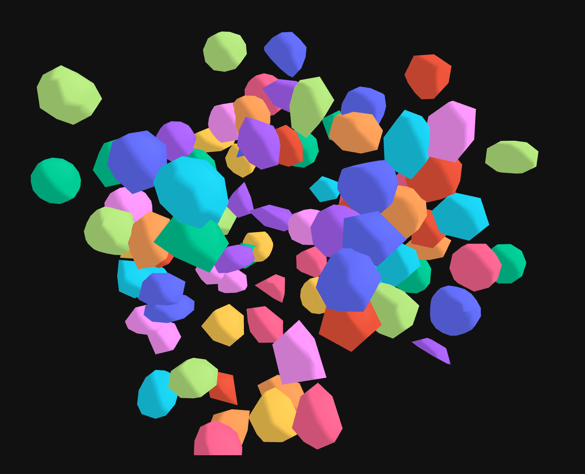
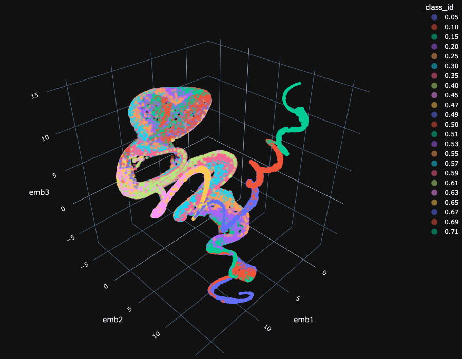

## Sparta
A pure-python library for computing high-order (tensorial) shape descriptors. This set of descriptors are naturally parsimonious because:

* they represent the next simplest category of functionals from simply linear functionals: they are **additive**. In plain english, they all behave like the usual volume, as the volume of the sum of two volumes is the sum of each volume minus the volume of their intersection.  

* These measures, again much like the volume, have a degree of invariance/covariance/equivariance to the euclidean group of motions. 

For these reasons they are understandably refered to by "generalized volumes". But they go by a range of other names. 

They can be very effective for the quantitative characterization of the shape of tridimensional objects. A further level of sparseness can of course be build upon this set, by using a machine learning feature selection framework such as the elastic net (lasso) or Umap. We illustrate such a simple pipeline in the examples. 

The figure below shows the Johnson's Solids -- an extended classification of non-regular but convex Polyhedra, after Plato's and Aristole's. These solids are shown here as geometrical reference points for the study of similar shapes, produced by physical/stochastic processes. 

In the next picture, we have a realization of a system of closed-packed spheres. The shapes of the 'rocks' are intrinsically associated with the packaging fraction of the emsamble.

The last picture shows how just 3 components among dozens --- constructed by a manifold learning technique called Umap, are enough to capture the geometrical information, continuously as a function the system's parameter (in this example packing fraction, shown in the colorscale as class_id). As one would expect, the variability of shapes signatures are fatter around the midrange .50 for packing fraction. Curious to know where the Johnson's solids fit in this same subspace? A paper will be out soon showing that and a few other systems together.   

  

In the examples, we show typical applications of stochastic morphometry, we are interested in the relationships of the object's shape, and the process by which those shapes are formed. The shapes, beloging to a set or family by a geometrical signature are slightly different among themselves, but similar enough to possess a specific class membership. We call a family of these shapes a **texture**.  

The next step for this project is to benchmark this cpu with a tensorflow2 implementation, so they can be used as building blocks for geometrically/topologically aware losses in 3D semantic segmentation. 

dependencies--so far:
    numba
    pyvoro 
    freud 
    trimesh
    plotly

This computation follows this paper: 
https://doi.org/101088/1367-2630/15/8/083028

and this paper:
https://www.sciencedirect.com/science/article/abs/pii/S037015730000106X

